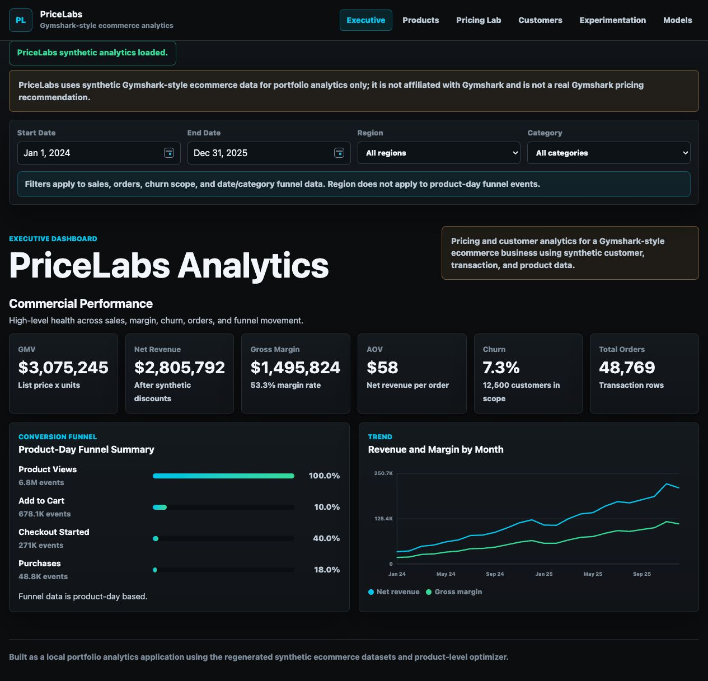
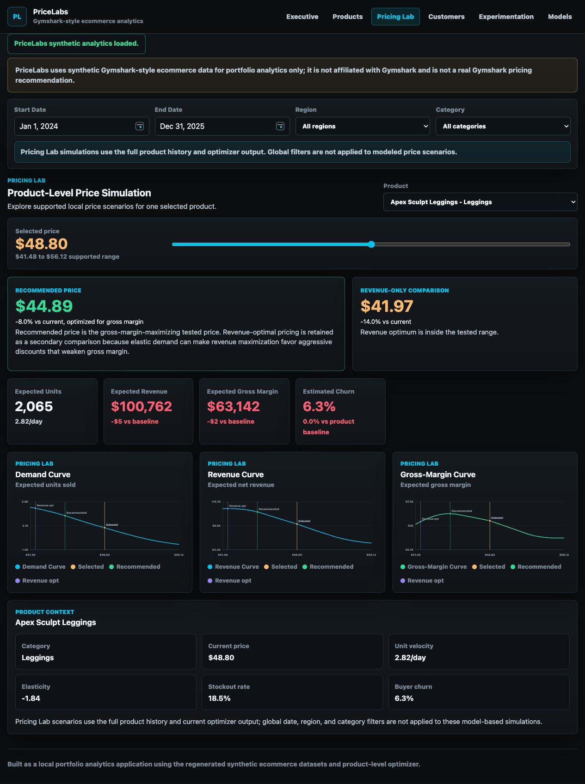

# PriceLabs

## Project Overview

PriceLabs is a portfolio e-commerce analytics platform for pricing and customer analytics in a Gymshark-style apparel business. It is modeled around a Gymshark-style ecommerce business using synthetic customer, transaction, product, churn, and behavioral data.

The main goal is to analyze pricing, customer behavior, and product economics in a realistic e-commerce setting so business teams can reason about revenue, margin, demand, and retention tradeoffs.

PriceLabs is an independent portfolio project using synthetic Gymshark-style data. It is not affiliated with or endorsed by Gymshark.

## Application Preview



*PriceLabs Executive Dashboard showing synthetic GMV, revenue, margin, churn, funnel, and trend metrics.*



*PriceLabs Pricing Lab showing product-level price simulation, demand, revenue, gross-margin curves, and the margin-based recommendation.*

## Business Problem

E-commerce pricing decisions create a direct tradeoff between higher unit prices, customer demand, churn risk, revenue, and gross margin. PriceLabs asks how a Gymshark-style apparel business can adjust prices without sacrificing profitability or customer retention.

## Application Features

- Executive dashboard with GMV, net revenue, gross margin, AOV, churn, and order KPIs.
- Date, region, and category filtering across supported dashboard views.
- Product analytics with product selector, current price, unit velocity, stockout rate, elasticity, product rankings, and category rankings.
- Product-level Pricing Lab with an interactive price slider, demand curve, revenue curve, gross-margin curve, recommended gross-margin-maximizing tested price, and revenue-optimal comparison.
- Customer analytics with churn by region, acquisition channel, tenure, and purchase frequency.
- Repeat-purchase cohort heatmap where M0 excludes each customer's first transaction.
- Experimentation page with A/B-style pricing analysis, causal IPW estimate, and robustness/refutation summary.
- Model benchmarking page comparing Logistic Regression and Random Forest churn models.

## Key Results

- Customers: 12,500
- Transactions: 48,769
- Products: 41
- Product-event rows: 29,971
- GMV: $3,075,245
- Net revenue: $2,805,792
- Gross margin: $1,495,824
- Gross margin rate: 53.3%
- AOV: $57.53
- Overall churn: 7.3%
- Price-increase exposure churn: 8.8%
- Non-exposed churn: 6.7%
- Naive churn difference: 2.16 percentage points
- Adjusted IPW causal estimate: 2.45 percentage points
- Bootstrap 95% CI: [1.31, 3.69] percentage points
- Logistic Regression ROC-AUC: 0.533
- Random Forest ROC-AUC: 0.524

The churn prediction models show modest discrimination, so they are presented as exploratory benchmarks rather than the primary pricing engine. Product pricing recommendations are driven by local elasticity estimates, product economics, and gross-margin optimization, with churn impact treated as a secondary retention adjustment.

## Methodology

- Synthetic data generation for customers, transactions, products, product events, churn, discounts, price exposure, inventory, and funnel activity.
- Exploratory analysis of revenue, margin, product performance, customer segments, funnel metrics, and price-demand patterns.
- A/B-style statistical testing comparing churn among price-exposed and non-exposed customers.
- Causal inference using IPW/backdoor adjustment with observed synthetic confounders.
- Product-level elasticity and demand modeling from synthetic product-event data.
- Gross-margin-based price optimization with revenue-optimal results retained as a secondary comparison.
- Churn-model benchmarking using Logistic Regression and Random Forest.

## Tech Stack

- Python for data generation, analysis logic, and pricing optimization.
- FastAPI for the local analytics API.
- Uvicorn for running the local web server.
- Vanilla HTML, CSS, and JavaScript for the custom dashboard frontend.
- CSV files for generated raw datasets.
- Jupyter notebooks for validation, exploratory analysis, experimentation, causal inference, and modeling.
- pandas, NumPy, Plotly, Matplotlib, DoWhy, and scikit-learn in the notebook analysis workflow.

## Repository Structure

```text
backend/
  app.py                    Local FastAPI backend for dashboard data

frontend/
  index.html                Custom web dashboard shell
  styles.css                Dark dashboard styling
  js/                       Frontend API, rendering, controls, and formatters

screenshots/
  executive-dashboard.png   Executive Dashboard application preview
  pricing-lab.png           Pricing Lab application preview

src/
  data_generation.py        Synthetic data generation logic
  revenue_optimizer.py      Product-level pricing optimizer

data/
  raw/                      Generated synthetic CSV datasets

notebooks/
  01_data_validation.ipynb
  02_exploratory_analysis.ipynb
  03_ab_test_analysis.ipynb
  04_causal_inference.ipynb
  05_churn_model.ipynb

requirements.txt            Runtime dependencies for the local web app
README.md
LICENSE
```

## Running Locally

From the repository root:

```bash
python3 -m uvicorn backend.app:app --reload --host 127.0.0.1 --port 8001
```

Then open `http://127.0.0.1:8001`.

If port `8001` is busy, replace it with another available port, such as `8002`.

## Limitations

- The analytical data is synthetic and intended for portfolio demonstration.
- Causal conclusions depend on the modeled assumptions and observed synthetic confounders.
- Elasticity estimates are local response estimates, not proof that the same demand curve applies far outside the tested range.
- Churn prediction has weak discrimination and is not used as the primary pricing decision engine.
- Product-event data is aggregated synthetic event data rather than real customer-level clickstream behavior.

## Portfolio Context

This project demonstrates business analytics, causal inference, experimentation, pricing economics, and full-stack analytics product development in a compact e-commerce decision platform.
